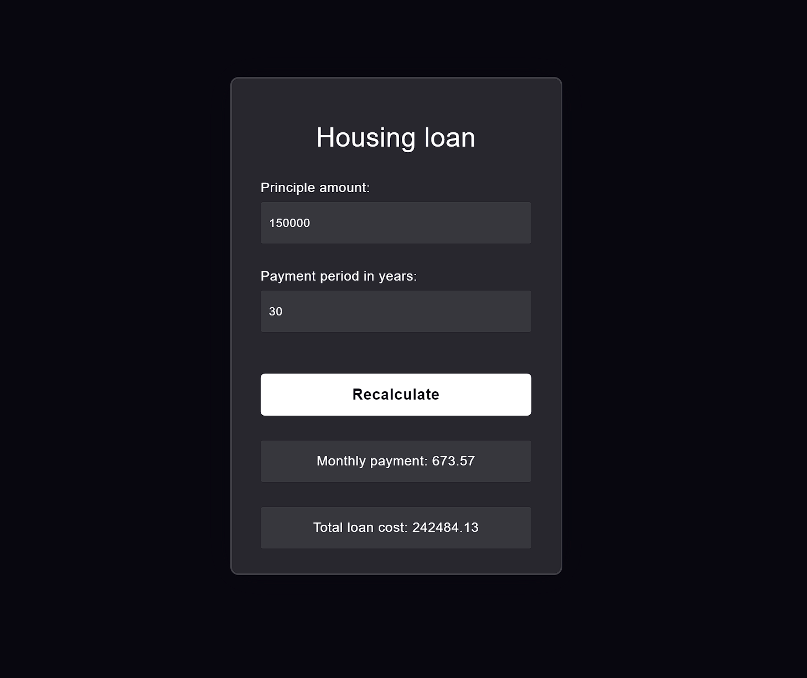

# Mortgage loan calculator

This is a simple Spring boot + Angular application that calculates monthly payment amount and the total cost of a loan when given the principle amount and period in years.
Meat and potatoes of backend calculations can be found in `HousingService.java`.

Client side can be run from package.json -> "start" (localhost:4200)

Server side can be run from LoanServerApplication.java -> "main" (localhost:8080)

